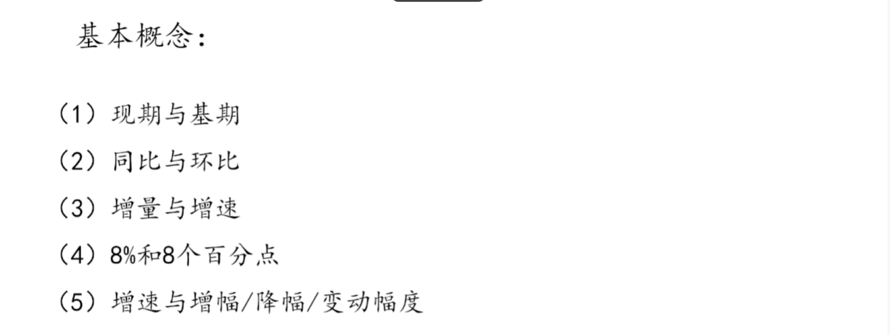
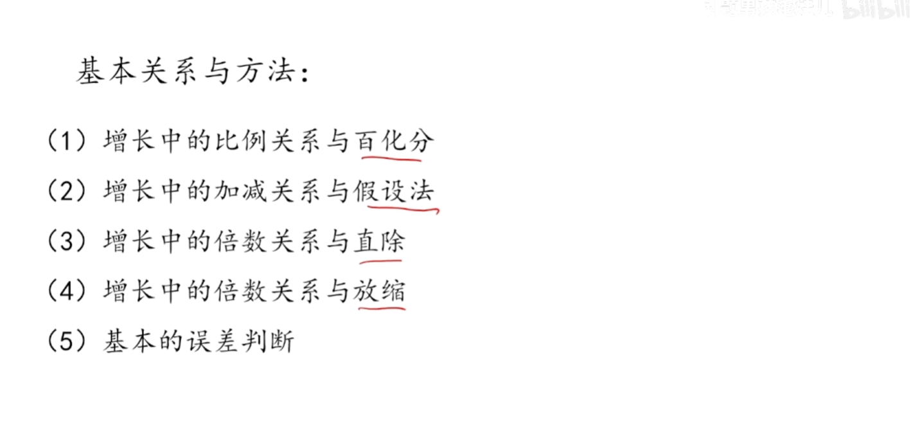

# 1. 资料分析第一章 · 基本功 — 基础概念与增长关系

> 资料分析是行测中**性价比最高**的模块：题量 20 道、分值高，全部掌握后正确率可达 90% 以上。本章先把最基础的概念和速算关系打牢，这是后面所有题型的基石。

---

## 一、资料分析五大基础概念



### （一）现期与基期

| 概念 | 定义 | 关键词 |
|------|------|--------|
| **基期** | 过去、作为对比参照的时期 | 原来 |
| **现期** | 现在、被研究的当前时期 | 现在 |

> **例：** 2015 年数值 100，2021 年数值 120，描述"2021 比 2015 增长" → **基期：2015 年；现期：2021 年**

**核心公式（两个方向）：**

```
现期值 = 基期值 × (1 + 增长率)
基期值 = 现期值 ÷ (1 + 增长率)
```

> 💡 **我的理解：** 找基期现期就看一句话里的"比"字 —— **"比"前面被拿来当参照的，就是基期**；被研究的、时间靠后的是现期。做题第一步永远是先圈出时间词，时间早的 = 基期，时间晚的 = 现期。上面两个公式本质是同一个乘除关系，用哪个取决于题目给了什么、要求什么。

---

### （二）同比与环比

| 概念 | 含义 | 例子（以 2016 年 3 月 18 日为例） |
|------|------|------|
| **同比** | 与**去年同一时期**相比（消除季节影响） | 对比 2015 年 3 月 18 日 |
| **环比** | 与**紧挨着的上一个统计周期**相比 | 对比 2016 年 3 月 17 日；3 月环比→对比 2 月；一季度环比→对比去年四季度 |

> 📌 **记忆口诀：** 同比看去年同期；环比看上一期。

> 💡 **我的理解：** 同比"固定看去年同一个月/季"，专门用来消除季节性波动（比如春节影响 1-2 月数据）；环比"往前推一个周期"。**最容易掉坑的点：一季度环比 = 去年四季度**，不是去年一季度。考试时先看清楚问的是"同比"还是"环比"，两个答案可能完全不同。

---

### （三）增长量（增量）与增长率（增速）

| 概念 | 本质 | 单位 | 公式 |
|------|------|------|------|
| **增长量（增量）** | 绝对变化量 | 有单位（元/万/吨…） | 增长量 = 现期 − 基期 |
| **增长率（增速）** | 相对变化幅度 | 无单位（%） | 增长率 = 增长量 ÷ 基期值 |

**对比示例：**

| 对象 | 基期 | 现期 | 增长量 | 增速 |
|------|------|------|--------|------|
| 甲 | 50 | 60 | 10 | 10/50 = **20%** |
| 乙 | 1000 万 | 1010 万 | 10 万 | 10/1000 = **1%** |

> ⚠️ **易错：** 增长量一样，增速不一定一样；增速大，增长量未必大 —— 关键看**基期大小**。基期小则增速容易高，基期大则增速看着小但增量可能很大。

> 💡 **我的理解：** 增长量是"多了多少"（有单位的绝对值），增长率是"多了百分之几"（相对幅度）。资料分析里**算增长率时基期永远在分母**，这是最高频的公式，必须形成条件反射。

---

### （四）增速、增幅、降幅、变动幅度

| 概念 | 含义 | 正负性 | 例子（增长率 −20% 时） |
|------|------|--------|------|
| **增速 / 增幅** | 等价，就是增长率 | 可正可负 | 增速、增幅 = −20% |
| **降幅** | 专指**下降**的幅度 | 只取正数 | 降幅 = 20%（−20% 取正值） |
| **变动幅度（变化幅度）** | 增长率取**绝对值** | 恒为正 | 变动幅度 = 20% |

> 📌 **口诀：** 增速/增幅带正负；降幅只看负的部分；变化幅度看绝对值。
>
> **例：** 增长 20% 与下降 20%，二者变动幅度（变化幅度）都是 20%。

> 💡 **我的理解：** 这三个词是经典的"文字陷阱"。重点记：**降幅出现的前提是"下降"**，增长率 +20% 时根本没有降幅；而降幅 = −20% 里的 20%（把负号去掉）。**变化幅度就是"不管正负，只看波动多大"**。考试常把"降幅收窄/扩大"结合增速一起考。

---

### （五）8% 和 8 个百分点

| 表达 | 本质 | 用法 |
|------|------|------|
| **8%（百分数）** | 相对比例 | 描述**增长率、比重本身**的大小。例：基期 100 增长 8%，现期 = 100×(1+8%) = 108 |
| **8 个百分点** | 两个百分数相减的**差值** | 描述两个比例之间**相差多少**。例：去年占比 10%、今年 15%，15%−10% = **5 个百分点** |

> ⚠️ **不能**说"相差 5%"，**必须**说"相差 5 个百分点"。

**快速区分：**
- 增长率、比重本身 → 用 **%**
- 两个百分比相比较差多少 → 用 **百分点**

> 💡 **我的理解：** 一句话记死 —— **"百分点是百分数的减法结果"**。凡是题目里"比重提升了几个百分点""增速上升了几个百分点"，本质都是两个百分数相减。这是资料分析出镜率最高的陷阱之一，看到"提升 5%"一定是错的，要写"5 个百分点"。

---

### 速记小清单

| 名词 | 本质 | 特点 |
|------|------|------|
| 基期 | 过去参照值 | 原来 |
| 现期 | 现在研究值 | 现在 |
| 同比 | 比去年同期 | 跨年份同月份/季度 |
| 环比 | 比上一个周期 | 紧挨着上一期 |
| 增长量 | 绝对变化 | 带单位，现 − 基 |
| 增长率（增速） | 相对变化 | %，增长量 ÷ 基期 |
| 增幅 | 等同于增速 | 可正可负 |
| 降幅 | 下降多少 | 只正数，增长率为负才存在 |
| 变化幅度 | 增长率绝对值 | 不看正负 |
| 百分点 | 百分数差值 | 两个 % 相减结果 |

---

### 巩固练习题

**Q1.** 已知：2024 年收入 800 万元，2025 年收入 920 万元，表述"2025 年较 2024 年有所增长"。请问基期、现期分别是哪一年？求 2025 年的增长量和增长率。

> **答案：** 基期：2024 年，现期：2025 年；增长量 = 920 − 800 = **120 万元**；增长率 = 120 ÷ 800 = **15%**。

**Q2.** 请写出下列时间对应的同比、环比对比时期：
① 2025 年第二季度　② 2025 年 11 月

> **答案：**
> ① 同比：2024 年第二季度；环比：2025 年第一季度
> ② 同比：2024 年 11 月；环比：2025 年 10 月

**Q3.** 判断对错并说明理由：甲行业基期 200、现期 240；乙行业基期 400、现期 440。结论：甲乙增长量相等，所以两者增长率也相等。（　）

> **答案：（×）** 甲增长量 = 40、增长率 = 40/200 = 20%；乙增长量 = 40、增长率 = 40/400 = 10%。**增长量相同、基期不同 → 增长率不同。**

**Q4.** 给出四个增长率：① +15%　② −15%　③ +8%　④ −8%
（1）哪一个的降幅为 15%？（2）哪两个的变化幅度相等？

> **答案：**（1）**② −15%**（降幅只看下降部分取正）；（2）**① 和 ②**（变化幅度看绝对值，±15% 幅度相等），同理 ③ ④ 也相等。

**Q5.** 去年某产品市场占比 22%，今年市场占比 27%。请问今年占比相较去年提升多少？书写上应当写 5% 还是 5 个百分点？

> **答案：** 27% − 22% = 5%，两个百分数做差，结果单位为**百分点**，应写**提升 5 个百分点**，不能写 5%。

---

## 二、增长基础关系（速算基础）



### 1. 增长中的比例关系与百化分

**思想：** 把增长率化作简单的分数（百化分），用"份数"思想快速求基期/现期/增量。

> **例题：** 减少 1/6，求基期、增量、现期的关系
> - 基期：6 份
> - 增量：−1 份（减少 1 份）
> - 现期：5 份

**常见百化分（必背）：**

| 分数 | 百分数 | 分数 | 百分数 |
|------|--------|------|--------|
| 1/2 | 50% | 1/9 | ≈11.1% |
| 1/3 | ≈33.3% | **1/10** | **10%** |
| 1/4 | 25% | 1/11 | ≈9.1% |
| 1/5 | 20% | **1/12** | ≈8.3% |
| **1/6** | ≈16.6% | 1/13 | ≈7.7% |
| **1/7** | ≈14.3% | **1/14** | ≈7.1% |
| 1/8 | 12.5% | 1/19 | ≈5.26% |

> 💡 **我的理解：** 百化分是资料分析**最重要的速算技巧**。核心思想：算"现期 ÷ 基期"这类除法很麻烦，但如果说"增长 25% = 基期 4 份，现期 5 份"，就能把乘除变成整数比例运算。**加粗的 1/6、1/7、1/10、1/12、1/14 是最高频考到的**，其余熟悉即可。看到增长率是 12.5%/16.6%/14.3%/25% 这类数，立刻反应成分数。

---

### 2. 增长中的加减关系与假设法

**核心公式：** 基期 + 增长 = 现期

```
A + A×R = B
（A = 基期，R = 增长率，B = 现期）
```

> 💡 **我的理解：** 这个式子只是把"现期 = 基期×(1+增长率)"展开写了。**假设法**的精髓是把基期 A 假设成单位 1 或份数，则现期 = 1 + R，于是所有计算都变成"1 和一个小数"的比例，配合百化分就能心算。做题时：增长率可化成简单分数 → 用份数；化不成 → 直接用公式。

---

### 3. 增长中的倍数关系与直除

**核心区分：** "增长多少倍" 和 "是多少倍" 差 1 倍。

```
增长 n 倍 = 是 (n+1) 倍
```

> 📌 **口诀：** "比...多 1 倍，就是 2 倍。"

| 表述 | 现期是基期的？ |
|------|------|
| 现期比基期增长 13% | 是 1.13 倍 |
| 现期比基期增长 30% | 是 1.3 倍 |
| 现期比基期增长 1 倍 | 是 2 倍 |
| 现期比基期增长 2.5 倍 | 是 3.5 倍 |

> 💡 **我的理解：** 这是问法陷阱的高频考点 —— "是几倍"永远比"增长几倍"大 1。资料分析里若问题问"是几倍"，直接用现期 ÷ 基期；若问"增长了百分之几/几倍"，要先减 1。**直除**就是直接做除法估算，结合下文的"放缩"和"误差判断"保证精度。

---

### 4. 增长中的倍数关系与放缩

**原理：** 分数的分子分母同时乘以同一个数，分数值不变。

```
2/3 = (2×2)/(3×2) = 4/6
2/3 = (2×1.1)/(3×1.1) = 2.2/3.3
```

> 💡 **我的理解：** 放缩是"直除的加速器"。直接除很慢，但把分子分母**同时放大或缩小到方便算的整数**，比值不变，就能心算。比如 3673 ÷ 14.3% ≈ 3673 ÷ 1/7 = 3673×7，一下就变成乘法。**核心是让分母变成"好算的数"（如 100、50、10 或百化分对应的整数）**。

---

### 5. 基本的误差判断（截位估算）

**误差控制目标：1% 以内**，用于数字截位估算，**保留 3 位有效数字**。

| 原数 | 保留 3 位有效数字 | 说明 |
|------|------|------|
| 2526 | 2520 | 截位 |
| 3673 | 3670 | 截位 |
| 1009 | 1010 | 四舍五入进位 |
| 1006 | ≈100 | 可近似当作 100 处理 |

> 💡 **我的理解：** 截位规则是"**保留 3 位有效数字**"：前 3 位保留，第 4 位四舍五入。误差只要控制在 1% 以内，对答案选项的判断（选项一般相差 3%~5%）就完全够用。**但注意：1009 → 1010 是把第 4 位的 9 进位了，这是四舍五入**；而 1006 ≈ 100 是大幅近似，只在精度要求不高时用。实际考试中不要盲目截位，**先看选项差距**：选项差距大可以放胆截，差距小（如 12.5% 和 13.5%）就要算准。

---

## 三、我的理解总结

资料分析整章的正确打开方式，一句话概括：**先定性，再选公式，最后速算**。

1. **定性**：拿到题目先圈时间词和关键词，确定是"基期/现期""同比/环比""增长量/增长率""是几倍/增长几倍""% / 百分点"。这一步错了，后面全错。
2. **选公式**：用本章的公式表和份数思想（百化分）选定计算路径。
3. **速算**：用放缩 + 截位估算，把误差控制在 1% 内，快速锁定选项。

**本章最该背下来的 4 件事：**
- 📌 同比看去年同期、环比看上一期（一季度环比 = 去年四季度）
- 📌 增长率 = 增长量 ÷ **基期值**（基期在分母）
- 📌 降幅只看负数；变化幅度看绝对值；百分点是"两个 % 相减"
- 📌 增长 n 倍 = 是 (n+1) 倍

---

## 本章小结

- ✅ 掌握了现期、基期的定义与两大核心公式（现期=基期×(1+r)）
- ✅ 区分了同比与环比，记住"同比看去年、环比看上一期"口诀
- ✅ 分清增长量（有单位）与增长率（无单位 %）的区别与换算
- ✅ 理清了增速/增幅/降幅/变动幅度四组易混概念
- ✅ 理解了 % 与百分点的本质差异，避免"相差 5%"的错误表述
- ✅ 背下常见百化分，掌握份数思想与放缩速算技巧
- ✅ 学会截位估算与 1% 误差控制

---

*原始素材：资料分析 01.docx（基本功章节）*
*整理日期：2026 年 8 月 13 日*
